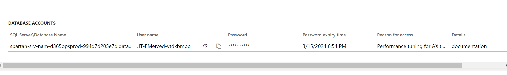

# How to Re-Enable Users on Tier-1 Environments, after a Database Refresh

Prerequisites: Access to [Lifecycle Services(LCS)](https://lcs.dynamics.com/v2), Access to SQL Server Management Studio, Basic knowledge of SQL**
## 1. Add IP address temporarily
* From [LCS](https://login.microsoftonline.com/common/oauth2/authorize?client_id=913c6de4-2a4a-4a61-a9ce-945d2b2ce2e0&response_type=code%20id_token&scope=openid%20profile&state=OpenIdConnect.AuthenticationProperties%3DA9gQXSqTp4tOBWIxp1Yls7W7hmNUYXsK283jO_1hA5Mr9pCxbeDObRGcmyz9I1mpoMHbc8r-RtmQXSdMQ3hojHUpxZLQWa6-H_D_PQAvivo44A-D&response_mode=form_post&nonce=638461156876151811.MjY2NjkyNWItODQ1Yy00YTQzLThjODItNTE1ZjAxN2ZkNDI5MzM1YmI1ZWYtYmE1Ni00OWIwLWE1YjAtZGFjNzgwYTgzYTU1&redirect_uri=https%3A%2F%2Flcs.dynamics.com%2F&post_logout_redirect_uri=https%3A%2F%2Flcs.dynamics.com%2F&x-client-SKU=ID_NET461&x-client-ver=6.32.0.0), go to environment where you need to re-enable user access (e.g. UAT, SAT)
* Click 'Maintain'
* Click 'Enable Access'
* Click '+'
* Enter an easily recognizable name for the inbound rule
* Click 'Confirm'
* Click 'Ok'
* Click 'Close' on the bottom right side of the screen to close the firewall rules window 
## 2. Request access to Database Accounts and [JIT Credentials](https://learn.microsoft.com/en-us/azure/defender-for-cloud/just-in-time-access-overview?tabs=defender-for-container-arch-aks)
* Scroll down to 'Database Accounts'
* Click on the 'Reason for access' drop-down menu
* Select 'Performance tuning for AX (write to AX)'
* Enter the specific reason for access in the 'Details' field (e.g. enabling users on SAT after database refresh)
* Click 'Request Access'
* Click 'Ok' and refresh the page for your temporary database credentials to appear
Your credentials will now appear under 'Database Accounts' in the following format:

	

**Note** that the SQL Server and database names are separated by a slash (SQL Server\Database Name). You may temporarily copy and paste the credentials separately on a notepad for easy management 
## 3. Re-enable disabled users via SQL Server Management Studio 
* Open Microsoft SQL Server Management Studio
	 
* Log in using the credentials you just obtained and confirm the following:
		Server type: Database Engine
		Server name: This will be the server name (before the slash)
		Authentication: SQL Server Authentication
		Login: This will be the username starting with 'JIT'
		Password: This will be the password provided (masked by * characters)
		To enter the database name (after the slash), go to 'Options<<', then 'Connection Properties' and enter the database name in the 'Connect to database' field
		
* Once logged in, in 'Object Explorer' expand 'Databases'
* Expand the database. It should be called 'db_d365opsprod' followed by the corresponding environment (e.g. db_d365opsprod_**gwnysat** for SAT, **gwnyuat** for UAT)
* Expand 'Tables'

	  

* Find 'dbo.USERFINFO' table. Right click on it, and select "Select first 1000 rows"

	
* You will notice the "ENABLE" column for users is set to '0'. To enable the users we need to set that to '1': 

	 
* Clear the query on the top window by clicking on it, and entering 'CTRL + A' then delete using your 'Backspace' or 'Del' button
* Enter and run the following query: 'UPDATE USERINFO set ENABLE=1'. This will change all '0's to '1's, thus re-enabling all users

	
